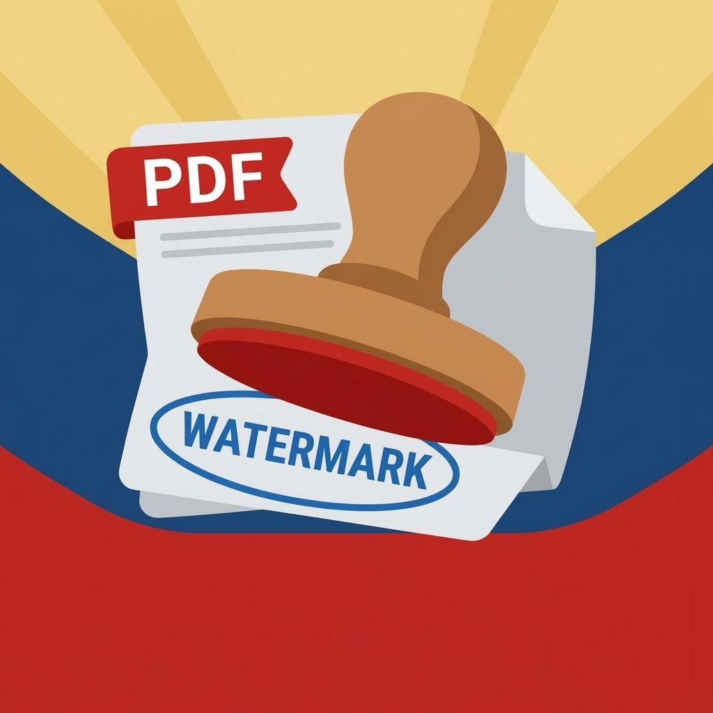

<div align="center">



# Stampy

**A fast, private PDF watermark tool. Preview, position, and stamp every page, right in your browser or on Android.**

[](https://br1jm0h4n.github.io/Stampy/)
[](https://github.com/BR1JM0H4N/Stampy/releases)

[](https://github.com/BR1JM0H4N/Stampy/stargazers)
[](https://github.com/BR1JM0H4N/Stampy/network/members)
[](https://github.com/BR1JM0H4N/Stampy/watchers)
[](https://github.com/BR1JM0H4N/Stampy/issues)
[](https://github.com/BR1JM0H4N/Stampy/pulls)
[](https://github.com/BR1JM0H4N/Stampy/commits)
[](https://github.com/BR1JM0H4N/Stampy/releases)
[](https://github.com/BR1JM0H4N/Stampy/releases)
[](https://github.com/BR1JM0H4N/Stampy)
[](https://github.com/BR1JM0H4N/Stampy)
[](LICENSE)
[](https://github.com/BR1JM0H4N/Stampy/pulls)

[](https://github.com/BR1JM0H4N/Stampy/actions/workflows/Build-app-dynamic-color.yml)


[Features](#-features) • [Live Demo](#-live-demo) • [Download APK](#-download-the-apk) • [How to Use](#-how-to-use) • [Tech Stack](#-tech-stack) • [Build](#-build-from-source) • [Structure](#-project-structure) • [Contributing](#-contributing)

</div>

---

## 📖 About

**Stampy** is a lightweight PDF watermarking tool. Pick a PDF, type your watermark text, drag it where you want it on a live preview, tweak size, opacity, rotation and color, then export. The watermark is stamped onto **every page** of the document.

Everything happens **on your device**. Your PDF is never uploaded anywhere. The same single-page web app runs in any modern browser and is also packaged as an **Android app** using [Capacitor](https://capacitorjs.com/).

## ✨ Features

- 📄 **Live PDF preview**: the first page is rendered with PDF.js so you can see exactly where the watermark lands
- ✍️ **Custom watermark text**
- 🖐️ **Drag to position**: mouse and touch supported, and the watermark is kept inside the page bounds
- 🔠 **Adjustable size** (5 to 100)
- 🌫️ **Adjustable opacity** (0 to 1)
- 🔄 **Rotation** from -180° to 180°, with a one-tap reset
- 🎨 **Color picker**
- 📑 **Applies to all pages** of the PDF in one go
- 📐 **Export size calibration (K)**: a Settings slider (0.5 to 1.5) to fine-tune how the exported watermark size matches the preview, saved between sessions
- 🔒 **100% offline and private**: no server and no uploads; PDF.js and pdf-lib are bundled locally
- 📱 **Native Android app** via Capacitor 8
- 🎨 **Material You / Dynamic Color**: on Android 12+ the app picks up your system wallpaper palette
- 💾 **Native file saving**: exported PDFs are saved straight to your **Downloads** folder (MediaStore on Android 10+)
- 🪵 **Built-in log panel** showing what the app is doing
- 🤖 **Automated APK builds** with GitHub Actions (debug or release)

## 🌐 Live Demo

Try it in your browser, no install needed:

### 👉 **https://br1jm0h4n.github.io/Stampy/**

> **Maintainer note:** if the link shows a 404, enable GitHub Pages: **Settings → Pages → Source: Deploy from a branch → `main` / `(root)`**. The page will be live in about a minute.

## 📲 Download the APK

### Option 1: From Releases (easiest)

1. Open the [**Releases**](https://github.com/BR1JM0H4N/Stampy/releases) page.
2. Under the latest release, download **`app-debug.apk`** (or the release APK if provided).
3. Open the file on your Android phone and tap **Install**.
4. If prompted, allow **"Install unknown apps"** for your browser or file manager (**Settings → Apps → Special access → Install unknown apps**).

### Option 2: Build it yourself with GitHub Actions

No computer setup required. GitHub builds the APK for you:

1. Fork this repo (or use your own copy).
2. Go to the **Actions** tab → **"Build APK v3 (nav preserved)"**.
3. Click **Run workflow**, choose **`debug`** (installable right away) or **`release`**, then click **Run workflow**.
4. Wait a few minutes until the run finishes, then open it.
5. Scroll to **Artifacts** and download **`app-debug`** (or **`app-release`**). It arrives as a ZIP, so unzip it to get the `.apk`.
6. Transfer the APK to your phone and install it.

> ⚠️ The **release** build is **unsigned** (`app-release-unsigned.apk`) and Android will refuse to install it until you sign it with your own keystore. For quick installs, use the **debug** build.

**Requirements:** Android 5.1+ (Capacitor 8 requires a recent Android WebView; Android 12+ is recommended for Dynamic Color).

## 🧭 How to Use

1. **Choose a PDF** using the file picker.
2. **Type your watermark text.**
3. **Drag** the watermark on the preview to position it.
4. Adjust **Size**, **Opacity**, **Rotation** and **Color**.
5. Tap **Apply watermark & download**.
6. Your watermarked PDF is saved (to **Downloads** on Android, or your browser's download location on the web).

**Tip:** if the exported watermark looks slightly bigger or smaller than the preview, open **⚙️ Settings** and nudge the **Export size (K)** slider.

## 🧰 Tech Stack

| Layer | Technology |
|---|---|
| UI | Vanilla HTML, CSS and JavaScript (single `index.html`), Material 3 styling |
| PDF rendering | [PDF.js](https://mozilla.github.io/pdf.js/) (`pdf.min.js`, `pdf.worker.min.js`) |
| PDF editing | [pdf-lib](https://pdf-lib.js.org/) (`pdf-lib.min.js`), Helvetica Bold text drawn on every page |
| Native shell | [Capacitor](https://capacitorjs.com/) 8 (`@capacitor/core`, `@capacitor/android`) |
| Plugins | `@capacitor/filesystem`, `@capacitor/splash-screen` |
| Android extras | Material Components 1.12 (Dynamic Color), custom JavaScript download bridge |
| CI/CD | GitHub Actions (Node 22, JDK 21, Gradle) |

## 🛠️ Build from Source

### Run in the browser

No build step needed. Serve the folder with any static server:

```bash
git clone https://github.com/BR1JM0H4N/Stampy.git
cd Stampy
npx serve .        # or: python3 -m http.server 8000
```

Then open the printed local URL.

### Build the Android app locally

**Prerequisites:** Node.js 22+, JDK 21, Android Studio / Android SDK.

```bash
git clone https://github.com/BR1JM0H4N/Stampy.git
cd Stampy
npm install

# Copy the web files into www/ (Capacitor's webDir)
mkdir -p www
cp index.html pdf.min.js pdf.worker.min.js pdf-lib.min.js www/

npx cap add android
npx cap sync android
npx cap open android      # then Build ▸ Build APK(s) in Android Studio
```

Or from the command line:

```bash
cd android
./gradlew assembleDebug
# APK: android/app/build/outputs/apk/debug/app-debug.apk
```

> The GitHub Actions workflow also injects the Dynamic Color bridge, the native download handler, the storage permission and the app icon automatically. For the full-featured Android build, the easiest route is the [workflow](#option-2-build-it-yourself-with-github-actions).

## 📁 Project Structure

```
Stampy/
├── .github/
│   └── workflows/
│       └── Build-app-dynamic-color.yml   # Builds the Android APK (debug / release)
├── index.html                # The entire app (UI + logic)
├── pdf.min.js                # PDF.js (preview rendering)
├── pdf.worker.min.js         # PDF.js worker
├── pdf-lib.min.js            # pdf-lib (watermark + export)
├── logo.png                  # App icon source
├── capacitor.config.json     # Capacitor config (appId: com.br1jm0h4n.stampy)
├── package.json              # v1.5.0, Capacitor dependencies
└── README.md
```

## ⚙️ Configuration

| File | Setting | Value |
|---|---|---|
| `capacitor.config.json` | `appId` | `com.br1jm0h4n.stampy` |
| `capacitor.config.json` | `webDir` | `www` (generated by the workflow) |
| `capacitor.config.json` | `server.androidScheme` | `https` |
| `capacitor.config.json` | Splash screen | 1 s, white background, no spinner |
| `index.html` | `GITHUB_USER` | Shown in **Settings → About me** (currently a placeholder; set it to `BR1JM0H4N`) |
| `index.html` | `K_DEFAULT` | Default export size factor (`0.94`) |

The app version is read from `package.json`. The workflow sets Android's `versionName` and `versionCode` from it, so bump `version` there before building a new release.

## 🤝 Contributing

Contributions, issues and feature requests are welcome!

1. Fork the repository
2. Create a branch: `git checkout -b feature/my-feature`
3. Commit your changes: `git commit -m "Add my feature"`
4. Push: `git push origin feature/my-feature`
5. Open a Pull Request

## 🗺️ Ideas for the Future

- [ ] Tiled / repeated watermark across the page
- [ ] Image (logo) watermarks
- [ ] Page range selection
- [ ] Custom fonts
- [ ] Signed release APKs via GitHub Releases
- [ ] iOS build

## 📄 License

No license file is included yet. Add a `LICENSE` file (for example [MIT](https://choosealicense.com/licenses/mit/)) and the license badge above will update automatically.

PDF.js is licensed under Apache-2.0 and pdf-lib under MIT.

## 👤 Author

**BR1JM0H4N**: [github.com/BR1JM0H4N](https://github.com/BR1JM0H4N)

## 🙏 Acknowledgements

[Capacitor](https://capacitorjs.com/) • [PDF.js](https://mozilla.github.io/pdf.js/) • [pdf-lib](https://pdf-lib.js.org/) • [Material Components](https://github.com/material-components/material-components-android) • [Shields.io](https://shields.io/)

<div align="center">

⭐ If Stampy is useful to you, please star the repo!

</div>
